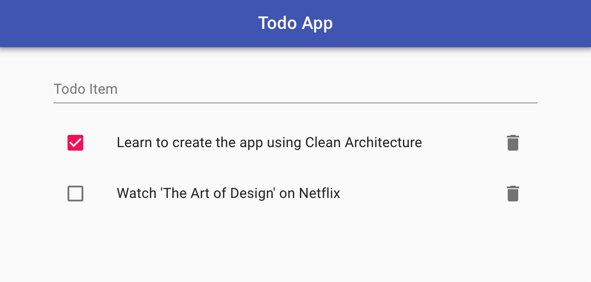

# cleanarchitecture-react-ts-todo-starter

UNDER DEVELOPMENT

## Feature tags

- clean-architecture
- react
- starter
- template
- todo
- typescript

---

## Author

[Alexander Lapygin](https://github.com/AlexanderLapygin) <<alexanderlapygin@gmail.com>>

## Inspired by

[clean-architecture-todo-example](https://github.com/kentaro-m/clean-architecture-todo-example)

# Clean Architecture Todo Example
An implementation example of the Todo app using Clean Architecture.



## Feature
- Add a task
- Complete a task
- Delete a task

## Usage
```bash
# API
$ cd api
$ npm install
$ npm start

# App
$ cd app
$ npm install
$ npm start
```

### License

Licensed under the [MIT license](./LICENSE).

---
